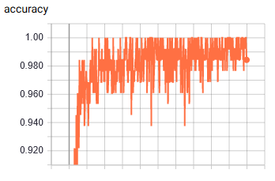
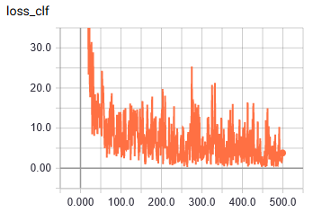

# test.CNN-F

Test the pre-trained CNN-F in TensorFlow with a simple classification model using MNIST.

Codes of CNN-F and pre-trained parameters are provided in [1].

# Usage

- `python main.py`
- `tensorboard --logdir log`

# Data

MNIST, zooming into [224, 224, 3].

# Result

- iter 0: 0.12269999995827675
- iter 450: 0.9907000076770782

# Environment

- tensorflow 1.12.0
- cuda 9.0

# References

1. [jiangqy/DCMH-CVPR2017](https://github.com/jiangqy/DCMH-CVPR2017)
